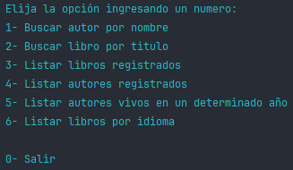
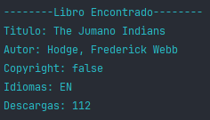
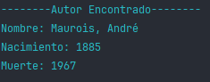

# LiterAlura Challenge
_______


Este proyecto es la entrega de un challenge impartido por AluraCursos.
Cuenta con una conexión a la api de Gutendex para obtener datos de libros
y autores, también cuenta con una conexión a una base de datos PostgreSQL
donde se guardaran los libros y autores buscados en la api.

## Iniciar el proyecto
Para iniciar el proyecto debe configurar la conexión a base de datos, esto 
lo puede hacer desde el archivo **application.properties**. 
 - Debe inicializar las variables de entorno para DB_HOST y DB_PASSWORD
 - Adémas debe crear una base de datos en postgreSQL con el nombre **books_db**.
````properties
spring.datasource.url=jdbc:postgresql://${DB_HOST}/books_db
spring.datasource.username=postgres
spring.datasource.password=${DB_PASSWORD}
spring.datasource.driver-class-name=org.postgresql.Driver
hibernate.dialect=org.hibernate.dialect.HSQLDialect
spring.jpa.show-sql=true
spring.jpa.format-sql=true
spring.application.name=literAlura

spring.jpa.hibernate.ddl-auto=update
````

## Funcionamiento
Al iniciar el proyecto desde el archivo **LiterAluraApplication** en consola obtendrá el siguiente resultado:



1- En la opción primera te preguntará que el nombre del autor a buscar. Al ingresar el nombre del autor se hara una petición
a la API para obtener el autor y mostrará los datos en pantalla. Adémas que el autor encontrado será guardado en la base de datos. 

2- En la opción segunda te preguntará el nombre del libro. Una vez ingresado buscará el nombre del libro en la API y imprimirá en
consola los datos encontrados. Adémas que guardara los datos en la base de datos.

3- Esta opción busca los libros en la base de datos y te los muestra en consola.

4- Esta opción busca los autores en la base de datos y te los muestra en consola.

5- La opción cinco te pedirá que ingreses un año luego buscara en la base de datos los autores que hayan estado vivos en el año
ingresado.

6- En la última opción le pedirá que ingrese un idioma y le mostrara los posibles idiomas a elegir. Una vez ingresado el idioma
buscará en la base de datos todos los libros que esten en el idioma solicitado.

** Datos de ejemplo a recibir **



## Conclusion
En este challenge he aprendido:
- Obtener datos de una API y serializarlos con la librería **Jackson**.
- Conectarme a una base de datos a través de variables de entorno para mantener mis datos seguros.
- Hacer queries con JPQL para la persistencia y obtención de los datos.
- Crear entidades y conectarlas entre sí.
- Manejo de excepciones. 